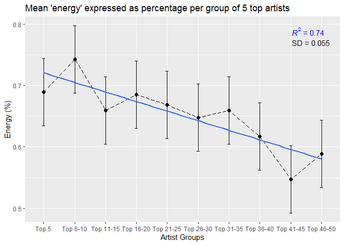
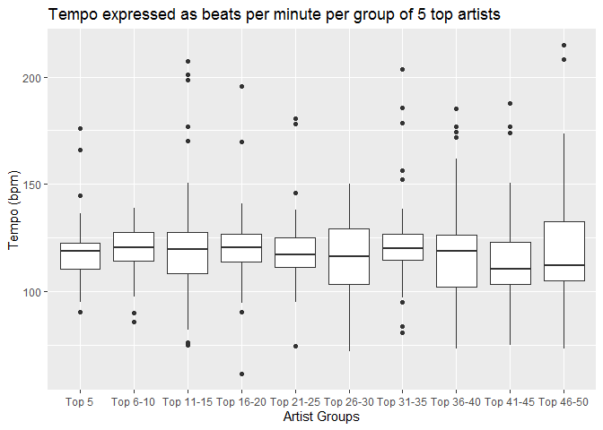
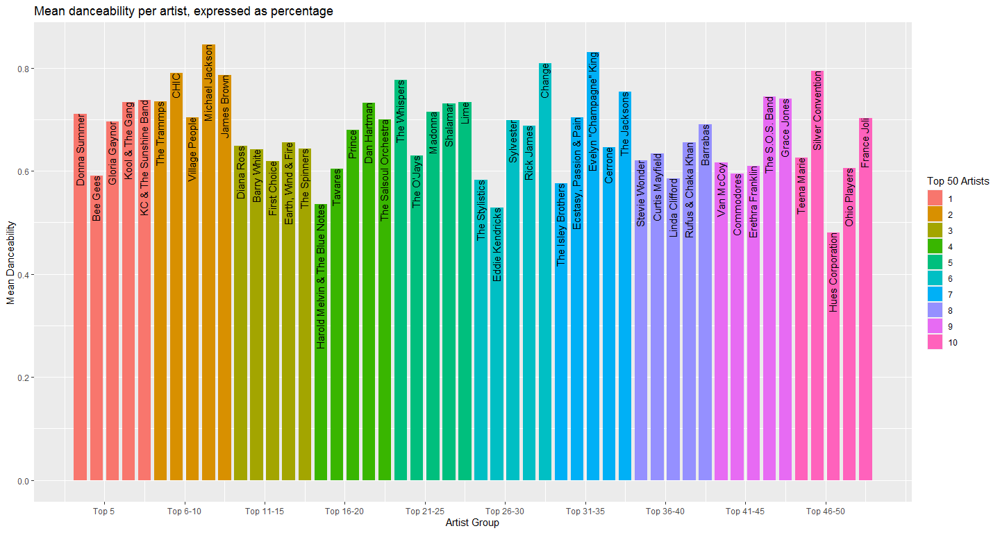

Boogie Wonderland - Is all Disco Music the Same?
================
Olivier Braas,
21 May 2021.

-   [Introduction](#introduction)
-   [Methods](#methods)
-   [Results](#results)
-   [Discussion and Conclusion](#discussion-and-conclusion)
-   [References](#references)
-   [Appendix](#appendix)
    -   [A - Replit Python Code](#a---replit-python-code)

## Introduction

      In the 1970s, underground music scenes in cities such as New York
provided the foundation for the development of funky dance music, now
known as disco. With roots in soulful jazz, disco had a difficult time
gaining traction as a (popular) genre (1). But what exactly is a genre?
A genre may be considered as an evolution from one music style to
another, often in a novel direction, typically motivated by a
socio-cultural driver. In hindsight, one can classify and identify music
belonging to a specific genre based on connected technical elements, as
well as factors extending beyond the scope of being quantifiable (2).
Such notions hold true for disco, as the genre embodied and inspired
social liberation among those marginalised by society, which were at the
time particularly African Americans and the gay community (3).  
      The idea of genres being forged from a cultural driver and sharing
similar technical elements may lead to the assumption that all songs of
a particular genre are the same. This is something that has been pointed
out to me on multiple occasions, particularly when I play disco around
my housemates. But is all disco music truly the same, and is it just
dance music?  
      Judging music to be similar is influenced by the aforementioned
technical elements, underlying socio-cultural drivers, but also personal
preference driven by potential pre-formed biases. Hence, the assessment
of similarity was based on statistical indicators from the analysis of
extracted Spotify variables. Before delving into the intricacies of the
genre, it is important to identify the key elements that comprise a
disco song.  
      Disco was a catalyst that not only rejuvenated social dancing but
introduced new styles of dance, mostly in the non-partnered form (4).
This novel style could be attributed to the underpinned energy and high
tempo (beats per minute, bpm) of the discotheque (stemming from post-war
French clubs, and later abbreviated to disco upon its rise in America)
and the people on the dance floor (3). The experience of this new dance
thus also defines an important element; danceability (which will be
defined later). Finally, the lyrics of the songs are crucial, as they
embody the message of the movement, of the song, of the artist.

## Methods

      As disco is not a common genre for analysis, all data had to be
retrieved directly from the source: Spotify. Before extracting
individual artist and song data from Spotify’s ‘for Developers’ (5)
programme, a selection of artists had to be made. Unfortunately, disco
literature is not widespread, so an online enthusiast-platform was
consulted for a top 100 artist list (6). The webpage administrator
confirmed that the list was based on users voting on their favourite
artists (between 1,000 and 10,000 voters).  
      After creating a playlist with the top 10 songs per artist (based
on number of plays in Spotify app), the data was extracted using Python
and Angelica Dietzel’s tutorial on BetterProgramming (7). The data
Spotify’s developer tool outputs had several variables, the chosen ones
being energy (measure of intensity and activity), tempo (beats per
minute), and danceability (based on musical elements such as rhythm,
tempo, beat strength and regularity of the song) (8).  
      Artists were grouped into groups of five, based on their position
on the previously mentioned chart, and the variables were averaged.
Before visualisation of the variables, histograms were produced to check
for the normality of the distributions. All variables had approximated
normal distributions.  
      Finally, data visualisation was done in R studio.

## Results

      The word cloud seen in Figure 1 displays words extracted from all
the titles of the top 10 songs from all the artists included in the top
50 list.

Figure 1. Word cloud of song titles from top 10 hits from all top 50
artists. Larger words represent more frequent appearance in song titles.

      Common themes are larger and represent more frequent occurrence,
for example, “love”, “boogie” and “12” (after the vinyl size: 12 inch).
While some words represented feelings of pleasure, like “heaven”, “good”
and “heart”, others showed tracks directly addressed to certain groups,
like “woman”, “girl”, and “lady”, and some tracks even mentioned the
genre itself; “disco”.  
      Figure 2 below shows the mean energy of each artist, expressed as
a percentage. A (blue) regression line clearly demonstrates a negative
correlation (R2 = 0.74) between energy and top 50 group (where ‘better’
groups produced songs of higher energy).

Figure 2. Mean energy from top 10 songs of every artist in each group.
The mean value for energy (%) from 10 artist groups (n = 5) is plotted,
with standard deviation (SD = 0.055) lines added. A linear regression
runs through the plot in blue, with an R2 value of 0.74.

      Between the artist groups there is no significant difference, as
the error bars representing standard deviation overlap (SD = 0.055) with
all neighbouring groups.  
      Figure 3 visualises the mean tempo in which the top artists
produced their music. All artists seemingly stick to a tempo valued
around 120 beats per minute.

Figure 3. Mean tempo from top 10 songs of every artist in each group.
The mean tempo (bpm) from the 10 artist groups (n = 5) are plotted.
Values mostly lie around 120 bpm.

      Songs which did not fall under this general 120 bpm rule
(outliers) tended to be more up-beat than mellower. Overall, artists
belonging to the most popular groups conformed more stringently to this
rule and showed less variability in tempo across their top 10 songs
compared to less popular artists within the top 50.  
      Figure 4 expresses the mean danceability value as a percentage in
a bar graph. The artist groups (1 – 10) are differentiated by colour (as
seen in the legend).

Figure 4. Mean danceability of top 10 songs from each artist in their
respective groups. Each artist group is assigned a different colour.
Mean danceability is expressed as a percentage per artist in each group
(n = 5).

      Every group sees a peak around 75% danceability rating, where most
artists lie between 60% and 75%. Only Michael Jackson, Evelyn
“Champagne” King and Change exceed the 80% threshold.

## Discussion and Conclusion

      Figure 2 made it clear that there were no significant differences
between neighbouring top artist groups. However, when observing artist
groups spaced further apart, significant differences do appear. This
notion of similarity between groups is nicely summarised by Richard
Dawkins’ book The Greatest Show on Earth. Dawkins explains that
differences between generations of a species are minute, yet, when
extending the scope, one notices distinct differences between
generations far apart (9). Perhaps this is applicable to music, and
artists that form a genre; as genres do develop and change over-time
(2). Distinct differences may be observed if the genre spanned for a
longer time, as the top artists may have had their prime in a distinct
period, being subjected to different cultural progenitors, and thus
resulting in varying technical elements defining their music.  
      Tempo (Figure 3) and danceability (Figure 4) values across artists
also fall within a narrow range. This may be attributed to the fact that
disco fueled the high-energy underground social movement of expression,
and thus needed to be danceable with a high tempo to classify as disco
(1). It is worth mentioning, however, that artists belonging to the
higher-ranking groups did generally display more focused bpm and
danceability values than those at the other end of the list.  
      The word cloud in Figure 1 revealed words that were descriptive of
the genre, and thus the movement. Love, the most central word, captures
the mentality of disco’s all-accepting history, and is further supported
by words radiating warmth, like “give”, “heaven” and “heart”.  
      To draw a conclusion whether all disco music is the same is
relatively straight forward from the analysis of the top 50 artists, and
their top 10 most popular songs: It seems like all disco songs are the
same, or at least, similar enough to be statistically insignificant.
Perhaps differences across the songs are not discernible with the
extracted variables used in this analysis and warrant further
exploration in the future, perhaps by refining the variables of interest
(e.g., exploring base lines and saxophone solos).  
      Although the original message of disco may be lost in modern
remixes, samples, and dance parties, the essence still lies in the
liberating power it offered during its rise to popularity, and is thus
not merely dance music. Finally, the similarity of technical
genre-defining elements may be a common theme among genres and should
also be investigated before finalising the claim that all disco music is
the same.

## References

1.  Echols A. Hot Stuff: Disco and the Remaking of American Culture.
    London: W. W. Norton & Company; 2011.
2.  Crauwels K. Musicmap: The Genealogy and History of Popular Music
    Genres from Origin till Present (1870-2016) \[Internet\]. 2020
    \[cited 2021 Apr 23\]. Available from: <https://musicmap.info/>
3.  Paul Stokes. 6 Ways Disco Changed the World \[Internet\].
    London; 2017. Available from:
    <https://www.bbc.co.uk/programmes/articles/23hgH64c0cvLlwYjfmzcztJ/6-ways-disco-changed-the-world>
4.  Lawrence T. Disco: Liberation of the Body \[Internet\]. 2013.
    Available from: <http://www.timlawrence.info/articles2/tag/Disco>
5.  Spotify. Spotify for Developers \[Internet\]. 2021. Available from:
    <https://developer.spotify.com/>
6.  DigitalDreamDoor. 100 Greatest Disco Artists \[Internet\]. 2005
    \[cited 2021 Apr 9\]. Available from:
    <https://digitaldreamdoor.com/pages/best_disco-artists.html>
7.  Dietzel A. How to extract any artist’s data using Spotify’s API,
    Python, and Spotipy \[Internet\]. 2020 \[cited 2021 Apr 18\].
    Available from:
    <https://betterprogramming.pub/how-to-extract-any-artists-data-using-spotify-s-api-python-and-spotipy-4c079401bc37>
8.  Spotify. Web API Reference \[Internet\]. 2021 \[cited 2021 Apr 9\].
    Available from:
    <https://developer.spotify.com/documentation/web-api/reference/#objects-index>
9.  Dawkins R. The Greatest Show on Earth. 1st ed. Black Swan; 2009.

## Appendix

### A - Replit Python Code

<https://replit.com/@braaaaaas/Disco#pyproject.toml>
